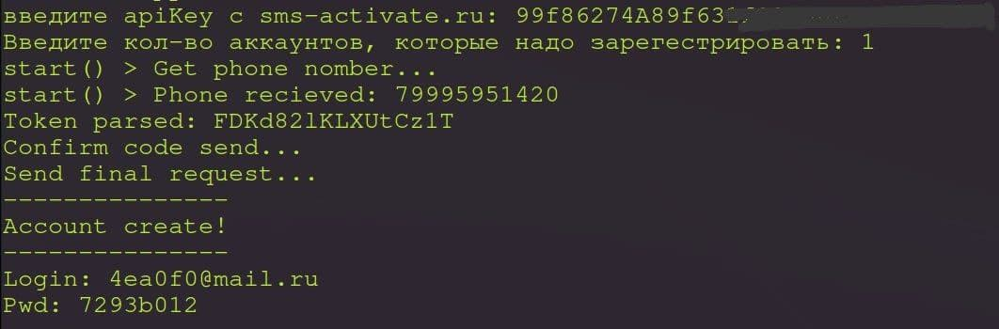

# Устоновка

- `git clone https://github.com/eXedna/mail.ru-autoreg`

- `cd mail.ru-autoreg`

- `sh install.sh`

- `./main.py`

# Api-ключ

> Чтобы регестрировать аккаунты вам необходимо получить api-ключ от sms-activate.ru
> 
> Получить его можно перейдя по ссылке https://sms-activate.ru/ru/api2 
>
> Он выглядит как рандомная 31 символная строка

# Работа со скриптом
> Запуск `./main.py`
>
> После запуска необходимо ввести ранее получениый api-ключ 
>
> Потом надо ввести кол-во аккаунтов которые надо зарегистрировать

